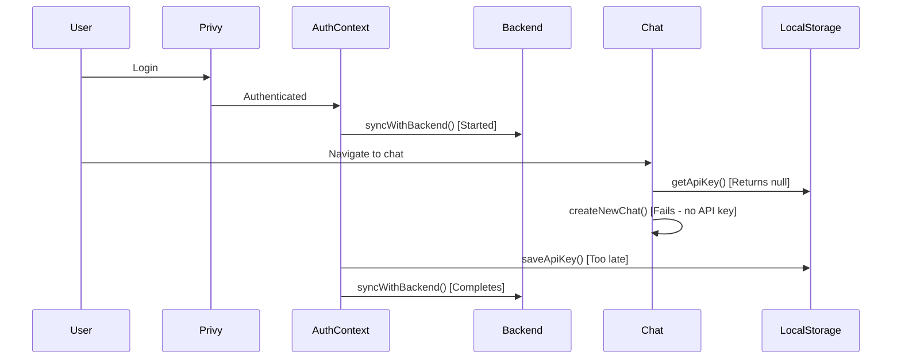
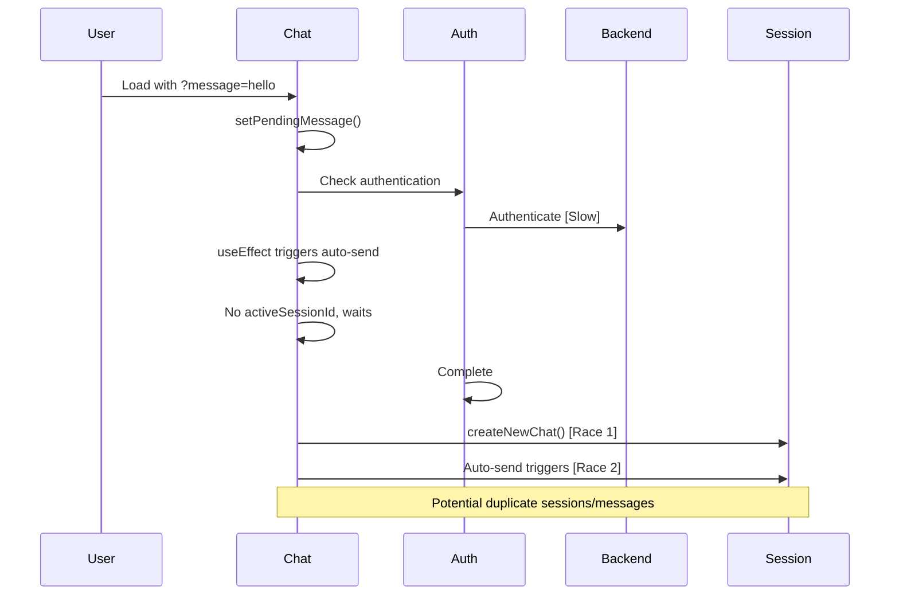
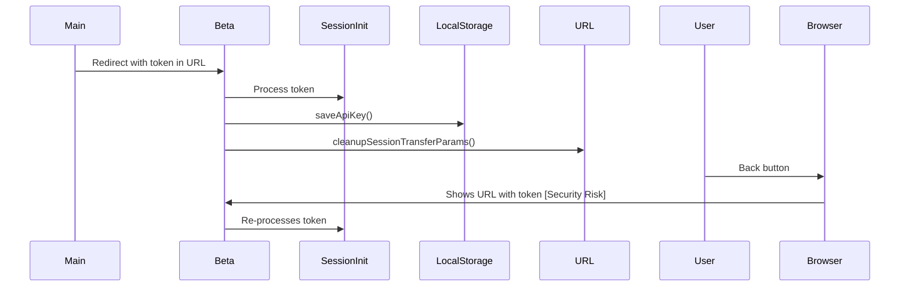

# Authentication & Session Flow Profile Report

## Executive Summary

This report profiles the full user authentication and chat session flow in the Gatewayz Beta application, identifying critical race conditions, error scenarios, and performance bottlenecks that could impact user experience.

## Key Findings

### 🔴 Critical Issues

1. **Multiple Concurrent Authentication Attempts**
   - Location: `src/context/gatewayz-auth-context.tsx:432-448`
   - Issue: While `syncInFlightRef` prevents concurrent syncs, there's a window where multiple components can trigger authentication simultaneously before the flag is set
   - Impact: Duplicate API calls, potential credential conflicts

2. **Session Creation Race Conditions**
   - Location: `src/app/chat/page.tsx:1809-1856`
   - Issue: Despite `creatingSessionRef`, there's a timing gap between check and flag setting
   - Risk: Multiple sessions created when user rapidly clicks or auto-send triggers

3. **Token Upgrade Race Condition**
   - Location: `src/context/gatewayz-auth-context.tsx:195-290`
   - Issue: `upgradeAttemptedRef` is set after async checks, allowing duplicate upgrade attempts
   - Impact: Multiple API key fetches, potential inconsistent state

4. **Cross-Domain Session Transfer Vulnerabilities**
   - Location: `src/components/SessionInitializer.tsx:108-176`
   - Issues:
     - Token exposed in URL parameters (even if briefly)
     - No validation of token origin/integrity
     - SessionStorage with 10-minute expiry could be hijacked

### ⚠️ Error Handling Gaps

1. **Silent Failures in Critical Paths**
   ```typescript
   // src/lib/chat-history.ts:325-328
   if (error.name === 'AbortError') {
     // Returns fake success instead of propagating error
     return { id: 0, session_id: sessionId, role, content, created_at: new Date().toISOString() };
   }
   ```

2. **Inconsistent Timeout Handling**
   - Auth context: 3-10 second timeouts
   - Chat API: 5-30 second timeouts
   - Streaming: 5 minute timeout
   - No unified timeout strategy

3. **Missing 401 Recovery**
   - Some endpoints clear credentials on 401
   - Others don't handle 401 at all
   - No automatic re-authentication flow

### 🔄 Race Condition Scenarios

#### Scenario 1: Rapid Login → Chat


#### Scenario 2: Pending Message Queue


#### Scenario 3: Beta Domain Redirect


### 📊 Performance Bottlenecks

1. **Sequential Authentication Steps**
   - Privy auth → Backend sync → API key upgrade → User data fetch
   - Total time: 3-15 seconds in worst case
   - Each step blocks the next

2. **Redundant API Calls**
   - User data fetched multiple times during session init
   - Sessions loaded before checking if new chat needed
   - Stats endpoint called even when known to fail

3. **Memory Leaks**
   - Event listeners not always cleaned up
   - Refs holding stale closures
   - Cache without TTL management

## Detailed Analysis

### Authentication Flow

#### Current Flow:
1. User triggers login via Privy
2. Privy authenticates and returns user object
3. `GatewayzAuthContext.syncWithBackend()` called
4. Backend `/api/auth` validates Privy token
5. API key and user data saved to localStorage
6. Optional: Upgrade temp API key for paid users
7. Components re-render with auth state

#### Race Conditions Identified:

1. **Double Authentication** (`gatewayz-auth-context.tsx:432`)
   ```typescript
   if (syncInFlightRef.current) {
     if (!options?.force) {
       return; // But multiple calls can enter before flag is set
     }
   }
   syncInFlightRef.current = true; // Gap allows race
   ```

2. **Stale Closure in Effects** (`chat/page.tsx:1264`)
   ```typescript
   const handleSendMessageRef = useRef<() => Promise<void>>();
   // Ref may hold stale closure with old state
   ```

### Session Management Flow

#### Current Flow:
1. Load existing sessions on mount
2. Check for URL message parameter
3. Create new session if needed
4. Handle pending messages
5. Auto-send if conditions met

#### Critical Issues:

1. **Session Creation Race** (`chat/page.tsx:1809`)
   ```typescript
   if (creatingSessionRef.current) {
     return null; // Check
   }
   // RACE WINDOW HERE
   creatingSessionRef.current = true; // Set
   ```

2. **Pending Message Loss**
   - If auth completes but session creation fails
   - Message stored in state, lost on error/refresh

### Error Handling Analysis

#### Timeout Inconsistencies:
| Component | Timeout | Behavior on Timeout |
|-----------|---------|-------------------|
| Auth Token Fetch | 3s | Continue without token |
| Backend Auth | 10s | Show error |
| Session Update | 10s | Show error |
| Message Save | 5s | Silent fail, fake success |
| Streaming | 5min | Abort and retry |

#### Missing Error Boundaries:
- No ErrorBoundary components wrapping critical sections
- Uncaught promise rejections in effects
- No fallback UI for failed auth states

## Recommendations

### Immediate Fixes (High Priority)

1. **Fix Race Conditions**
   ```typescript
   // Use atomic operations
   const attemptAuth = useCallback(async () => {
     const wasInFlight = syncInFlightRef.current;
     syncInFlightRef.current = true;
     if (wasInFlight && !force) return;
     // ... rest of logic
   }, []);
   ```

2. **Implement Proper Queueing**
   ```typescript
   const messageQueue = useRef<QueuedMessage[]>([]);
   const processQueue = useCallback(async () => {
     while (messageQueue.current.length > 0) {
       const msg = messageQueue.current.shift();
       await sendMessage(msg);
     }
   }, []);
   ```

3. **Add Circuit Breaker Pattern**
   ```typescript
   class CircuitBreaker {
     private failures = 0;
     private lastFailTime = 0;
     private readonly threshold = 3;
     private readonly timeout = 60000;

     async execute(fn: () => Promise<T>): Promise<T> {
       if (this.isOpen()) {
         throw new Error('Circuit breaker is open');
       }
       try {
         const result = await fn();
         this.reset();
         return result;
       } catch (error) {
         this.recordFailure();
         throw error;
       }
     }
   }
   ```

### Medium Priority Improvements

1. **Unified Timeout Strategy**
   - Create central timeout configuration
   - Implement progressive timeout increases
   - Add timeout telemetry

2. **Enhanced Error Recovery**
   - Implement exponential backoff
   - Add retry queues for failed operations
   - Create error recovery workflows

3. **Session State Machine**
   - Replace boolean flags with state machines
   - Prevent invalid state transitions
   - Add state transition logging

### Long-term Architecture Changes

1. **Event-Driven Architecture**
   - Replace polling with WebSocket connections
   - Implement server-sent events for auth updates
   - Use message bus for component communication

2. **Optimistic UI Updates**
   - Show UI immediately, reconcile later
   - Implement conflict resolution
   - Add undo/redo capabilities

3. **Progressive Enhancement**
   - Load critical path first
   - Defer non-essential operations
   - Implement service worker for offline support

## Security Recommendations

1. **Token Handling**
   - Never expose tokens in URLs
   - Use secure cookies for cross-domain transfer
   - Implement token rotation

2. **Session Validation**
   - Add CSRF tokens
   - Implement session fingerprinting
   - Monitor for session anomalies

3. **Rate Limiting**
   - Client-side request throttling
   - Server-side rate limits per user
   - Progressive delays on failures

## Performance Optimizations

1. **Parallel Loading**
   ```typescript
   const [sessions, userData, stats] = await Promise.all([
     loadSessions(),
     fetchUserData(),
     getStats().catch(() => null) // Don't fail on stats
   ]);
   ```

2. **Lazy Loading**
   - Load chat messages on demand
   - Virtualize long session lists
   - Implement infinite scrolling

3. **Caching Strategy**
   - Implement proper cache invalidation
   - Use IndexedDB for large datasets
   - Add cache warming for common paths

## Monitoring Recommendations

1. **Add Telemetry for:**
   - Authentication duration
   - Session creation time
   - Race condition occurrences
   - Error rates by type

2. **Create Dashboards for:**
   - Auth success/failure rates
   - Session creation patterns
   - Timeout frequency
   - User journey completion

3. **Set Up Alerts for:**
   - Auth service degradation
   - Spike in race conditions
   - Unusual error patterns
   - Performance regression

## Conclusion

The authentication and session flow has several critical race conditions and error handling gaps that could significantly impact user experience. The most pressing issues are:

1. **Race conditions** in authentication sync and session creation
2. **Inconsistent error handling** leading to silent failures
3. **Security vulnerabilities** in cross-domain session transfer

Implementing the immediate fixes would resolve the most critical issues, while the medium and long-term improvements would create a more robust and maintainable system.

## Appendix: Test Scenarios

### Test Case 1: Rapid Login/Logout
```javascript
// Simulate rapid auth state changes
for (let i = 0; i < 10; i++) {
  login();
  await wait(100);
  logout();
  await wait(100);
}
// Expected: No duplicate API calls, clean state
```

### Test Case 2: Concurrent Session Creation
```javascript
// Trigger multiple session creations
Promise.all([
  createNewChat(),
  createNewChat(),
  createNewChat()
]);
// Expected: Only one session created
```

### Test Case 3: Network Failure Recovery
```javascript
// Simulate network failures
mockFetch.failNext(3);
await sendMessage('test');
// Expected: Retry with backoff, eventual success
```

### Test Case 4: Token Refresh During Operation
```javascript
// Expire token mid-operation
await startLongOperation();
expireToken();
await completeLongOperation();
// Expected: Automatic re-auth, operation completes
```

---

*Generated: November 18, 2024*
*Version: 1.0.0*
*Author: Terry (Terragon Labs)*